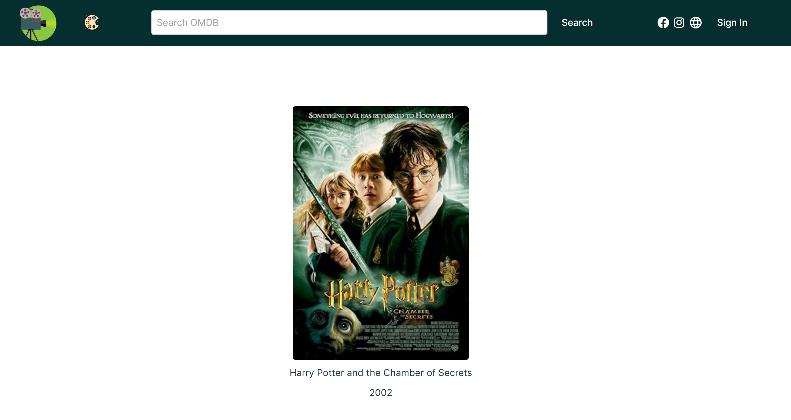
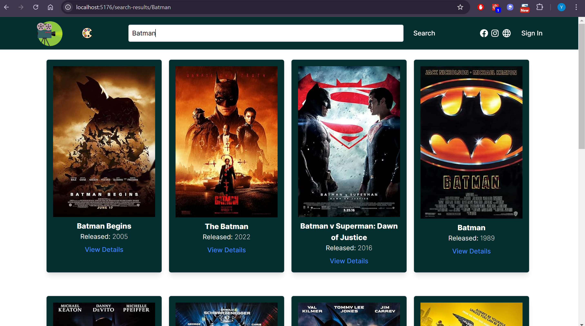
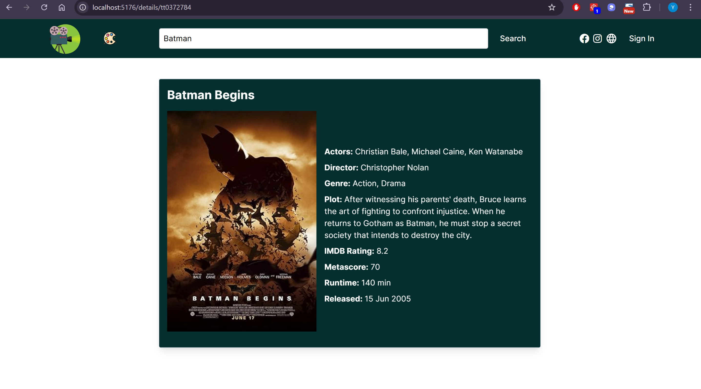
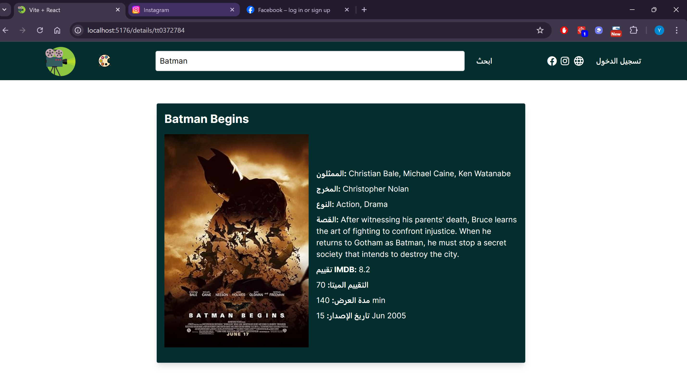
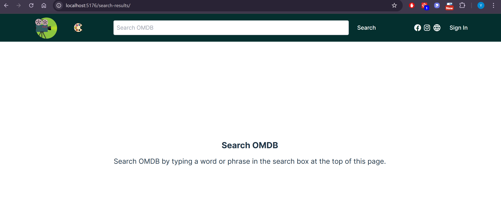
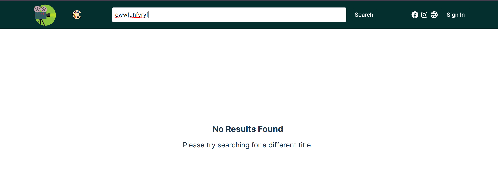
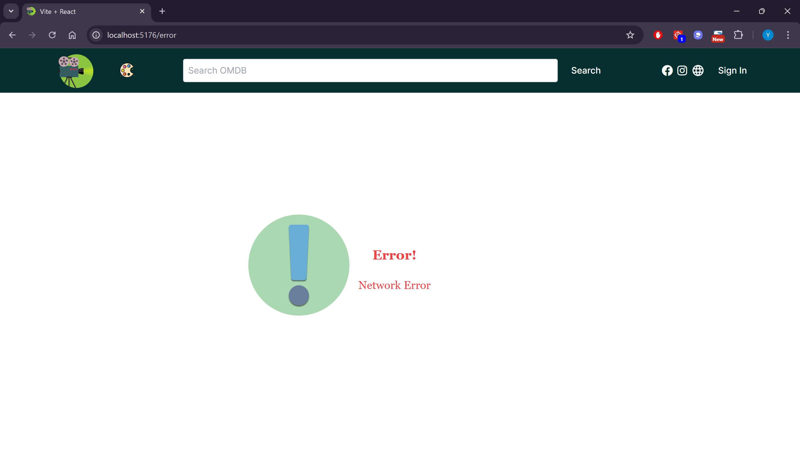
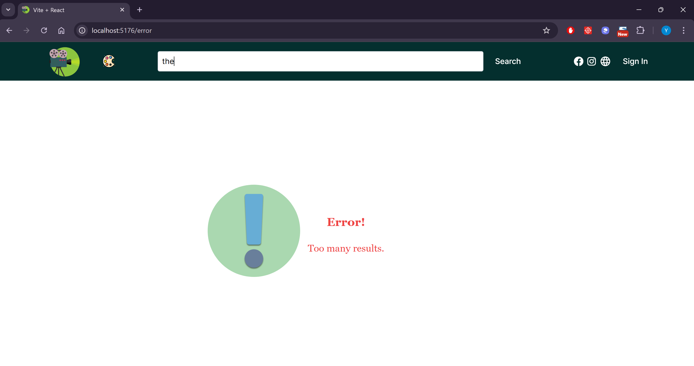

# Movie Database App


## Overview

The Movie Database App is a React-based web application that allows users to search for movies, view movie details, and see top-rated movies. The app uses the OMDB API to fetch movie data and Zustand for state management. The app is styled using Tailwind CSS and includes responsive design for various screen sizes.

## Features

- **Search Movies**: Users can search for movies by typing a query in the search bar.
- **View Movie Details**: Users can click on a movie to view detailed information about it.
- **Slide Show**: The app displays a list of movies on the home page.
- **Language Switch**: Users can switch between English and Arabic languages.

## In Progress
- **Pagination**.
- **Sort Search Results**.
- **Enhance Responsiveness**.
- **Theme Switch**: Users can switch between light and dark themes.
- **Unit Tests**: Unit tests will be added to test the whole application.


## Application










## Components

### Home
- Displays a slider of movies.
- Each movie in the slider is clickable and navigates to the movie details page.

### MovieDetails
- Displays detailed information about a selected movie, including actors, director, genre, plot, IMDb rating, and more.

### SearchBar
- Allows users to search for movies.
- The search bar is hidden on small screens and can be toggled by clicking the search button.

### SearchResults
- Displays the search results based on the user's query.
- Shows a message if no results are found.

### ErrorPage
- Displays an error message if there is an issue with fetching data from the API.
- Automatically retries fetching data and navigates back to the home page if successful.

## Project Dependencies

- [React](https://react.dev/) a JavaScript library for building user interfaces.
- [OMDB API](https://www.omdbapi.com/) for providing movie data.
- [Vite](https://vitejs.dev/) for the development server and build tool.
- [Zustand](https://zustand-demo.pmnd.rs/) for state management.
- [Tailwind CSS](https://tailwindcss.com/) for styling.
- [Font Awesome](https://fontawesome.com/) for icons.
- [i18next](https://www.i18next.com/) for internationalization.
- [Axios](https://axios-http.com/) for making HTTP requests.
- [React Router](https://reactrouter.com/) for handling client-side routing.
- [Jest](https://jestjs.io/) for testing.

## Project Structure
```
movie-database-app/ 
	├── public/
	│	├── homeIcon.svg 
	├── docs/ 
	│	├──  HomePage.png
	│	├──  SearchResults.png
	│	├──  MovieDetails.png
	│	├──  Localization-SocialMediaIcons.png
	│	├──  EmptySearch.png
	│	├──  NotFoundSearch.png
	│	├──  NetworkErrors.png
	│	├──  APIErrors.png	
	├── src/
	│	├── assets/ 
	│	│ ├── homeIcon.svg 
	│	│ ├── theme1.svg 
	│	│ └── languageIcon.svg 
	├── components/ 
	│ │ ├── Home.jsx 
	│ │ ├── MovieDetails.jsx
	│ │ ├── SearchBar.jsx
	│ │ ├── SearchResults.jsx
	│ │ └── Error.jsx
	│ ├── stores/ 
	│ │ ├── movieStore.js 
	│ │ └── appConfigurationStore.js
	│ ├── styles/ 
	│ │ └── slider.css
	│ ├── App.jsx 
	│ ├── main.jsx 
	│ └── i18n.js
	├── index.html
	└── README.md
```
## Getting Started

### Prerequisites

- Node.js and npm installed on your machine.

### Installation

1. Clone the repository:
   git clone https://github.com/your-username/movie-database-app.git

2. Navigate to the project directory:
   cd movie-database-app

3. Install the dependencies:
   npm install

Running the App
   1. Start the development server:
	  npm run dev
   2. Open your browser and navigate to http://localhost:3000.
   
Building the App
   1. Build the app for production:
      npm run build
   2. Serve the production build:
      npm run server
   
License

- This project is licensed under the MIT License. See the LICENSE file for details.

## Acknowledgements

- [Icon Finder](https://www.iconfinder.com/) for icons.
